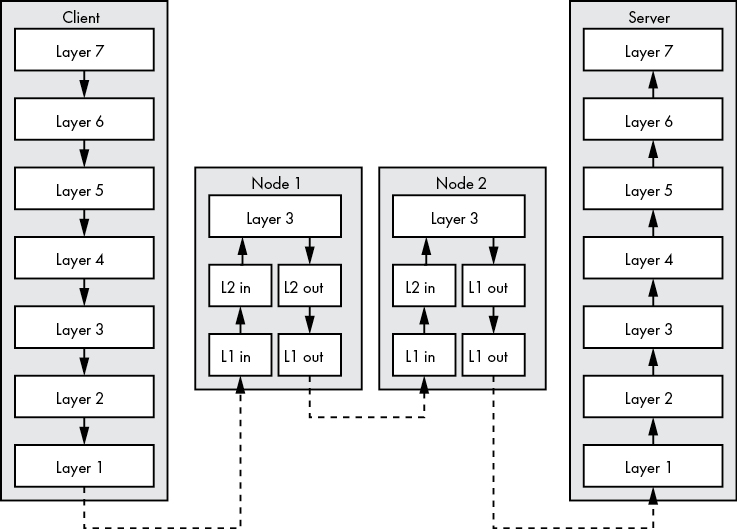

# Resource Location and Traffic routing


# Internet protocol

<br>

## IPv4

* Successor of ARPANET (in 1983)
* 4 groups of 8 bits (32 Bits) — 4 Octets


<br>

### Network Id and Host ID

You an use Classless Inter-Domain Routing (CIRD) to define your network of slit your network into multiple subnets. We use a CIDR network prefix to indicate the number of bit which constitue the network ID.

> Example: `192.168.156.97/16` means that the first `16 Bits` are part of the network ID.

<br>

### ARP 

**ARP** is used to resove a MAC from a given IP. The MAC geing the physical adress of a node in the network.

<br>

## IPv6

**IPv6** Was created to mitigate the lack of IPv4 addresses.

An IPv6 address has 8 columns of 16 bits i.e it is a 128 Bits long address (8 hextets).

Eg: `fd00 : 4700 : 0010 : 0000 : 0000 : 0000 : 6814 : d103`

<br>

### IPv6 Network and Host Addresses

Like IPv4, IPv6 also ahs a network address and a host address.
The host address is called the **interface ID**. IPv6 is simple than IPv4 in that network and host address have both 64 Bits.


```
IPv6 Address = 
  Network Address (GRP:48 Bits + SubnetID:16Bits) 
  + 
  Host Address (InterfaceID: 64Bits)
```

```
Network Address = 
  Global Routing Prefix (GRP) (48 Bits) 
  + 
  Subnet ID (16 Bits)
```

### IPv6 Address assignment from ISP

1. Request made to IANA to get the 1rst hextet of the GRP (for the region registry)
2. The regional registry assign the 2nd hextet
3. The ISP assign the 3rd hextet

### IPv6 common address space

`2000::/3` : Global use
`fc00::/7` : Unique local address like `127.0.0.0/8` subnet in IPv4

#### Example 

> Let’s assume your ISP assigned the 2600:fe56:7891::/48 netblock to you. Your 16-bit subnet ID allows you to further subdivide your netblock into a maximum of 65,536 (216) subnets. Each of those subnets supports over 18 quintillion (264) hosts.
> 
  > If you assign 1 to the subnet as shown in Figure 2-10, you’d write the full network address as 2600:fe56:7891:1::/64 after removing leading zeros and compressing zero value hextets. 
>
  > Further subnetting your netblock may look like this: 2600:fe56:7891:2::/64, 2600:fe56:7891:3::/64, 2600:fe56:7891:4::/64.

### IPv6 Categories

* Unicast
* Multicast
* Anycast (a group of node listening to the same address — but only the nearest node get the message)
  Nearest, isn't also the most physically close node; it is defined by the router.


## IPv4 vs IPv6

* **Simplified header format for IPv6**: Improves routing efficiency, and its design eases the processing of headers and eliminate the need for checksum calculation at every hop.

* **Stateless address configuration**: No need for DHCP or any static assignment of IPs. IPv6 uses *stateless address autoconfiguration*(SLAAC) to reduce administrative overhead. With the technique, a node can derive its interfaceID from its MAC Address (48 Bits) (Originally Unique Identifier OUI:24 Bits + Network Interface Controller NIC:24 Bits ) and  + FFFE:16 Bits

### Security concerns

THe fact that your interfaceID contains your NIC's Mac address, makes possible for anyone to know about your online activity. That why the [rfc4941](https://datatracker.ietf.org/doc/html/rfc4941/) addresses this issue by randomizing the interface ID; and letting the  Neighbor Discovery Protocol(NDP) to fix any duplicate interface ID for you.

**IPv6** has **native support for IPsec**, a technology that allows multiple nodes to dynamically create secure connections between each other, ensuring that traffic is encrypted.


## ICMP (ICMPv4 / ICMPv6)
It is use to give feedback about the local network. Its the responsability of the router to inform you about:

* Node being unreachable. (ICMP echo request/reply)
* Better route to your destination node

> IPv6’s NDP relies heavily on ICMP router solicitation messages to properly configure a node’s NIC.


<br>

# Internet Traffic Routing


## Network traffic flow 



## Routing Protocols

Routing can by determine by:
  - Hop count
  - Bandwidth
  - Other means

Routing can be done internally or externally of an autonomous system.

An autonomous system is an organization that manages one or more networks. (Eg: an ISP)

> This ASN is used to broadcast an ISP’s network information to other autonomous systems using an external routing protocol. 

> BGP since it is the glue of the internet, binding all ASN-assigned ISPs together.

### BGP

**The Border Gateway Protocol (BGP)** allows ASN-assigned ISPs to exchange routing information. 

> BGP can be use to mitigate DDOS attacks: 
>
  > Companies that specialize in mitigating DDOS attacks use BGP to reroute all traffic destined for the victim node to their AS networks, filter out the malicious traffic from the legitimate traffic, and route the sanitized traffic back to the victim, nullifying the effects of the attack.
  https://youtu.be/ttDUoDf6xzM

<br>

## Name and Address Resolution

**DNS** is use to match IP addresses to domain names. All domains are children of a top-level domain, such as .com, .net, .org, and so on.


### Example of SOA DNS query

```bash
dig trueskil.io  soa

; <<>> DiG 9.10.6 <<>> trueskil.io soa
;; global options: +cmd
;; Got answer:
;; ->>HEADER<<- opcode: QUERY, status: NOERROR, id: 63049
;; flags: qr rd ra; QUERY: 1, ANSWER: 1, AUTHORITY: 0, ADDITIONAL: 1

;; OPT PSEUDOSECTION:
; EDNS: version: 0, flags:; udp: 1472
;; QUESTION SECTION:
;trueskil.io.			IN	SOA

;; ANSWER SECTION:
trueskil.io.		900	IN	SOA	ns-1083.awsdns-07.org. awsdns-hostmaster.amazon.com. 1 7200 900 1209600 86400

;; Query time: 35 msec
;; SERVER: 192.168.10.1#53(192.168.10.1)
;; WHEN: Wed Jul 14 16:43:23 CEST 2021
;; MSG SIZE  rcvd: 125
```

* Primary DNS server : `ns-1083.awsdns-07.org.`
* Admin email address : `awsdns-hostmaster.amazon.com. => awsdns-hostmaster@amazon.com.` 


### Example of PTR record

**The Pointer (PTR) record** allows you to perform a reverse lookup by accepting an IP address and returning its corresponding domain name. 

Let's see how to get the domain name for the IP `8.8.4.4`

```sh
$ dig 4.4.8.8.in-addr.arpa. ptr

# -- snip --
# ;QUESTION
# 1 4.4.8.8.in-addr.arpa. IN PTR
# ;ANSWER
# 4.4.8.8.in-addr.arpa. 21599 IN PTR # 2google-public-dns-b.google.com.
# -- snip --
```

```sh
dig 59.196.251.205.in-addr.arpa  ptr
```

> The IP address must be written in reverse order with the suffix `in-addr.arpa`


## Multicast DNS

**Multicast DNS(mDNS)** is a protocol that facilitates name resolution over a local area network (LAN) in the absence of a DNS server. When a node wants to resolve a domain name to an IP address, it will send a request to an IP multicast group. Nodes listening to the group receive the query, and the node with the requested domain name responds to the IP multicast group with its IP address. 

### Security concerns

DNSSEC doesn't encrypt the DNS Traffic between the client and the DNS server. It enable DNS servers to prouve that they are the one which respond to the DNS queries.
It uses crypto signature on the DNS record for the requester to verify than the reponses hasn't been tempered.

To encrypt DNS Traffic and at the same time addresses privacy concerns you may look at:

* DNS over TLS ([RFC-7858](https://tools.ietf.org/html/rfc7858/))
* DNS over HTTPS ([RFC-8484](https://tools.ietf.org/html/rfc8484/))